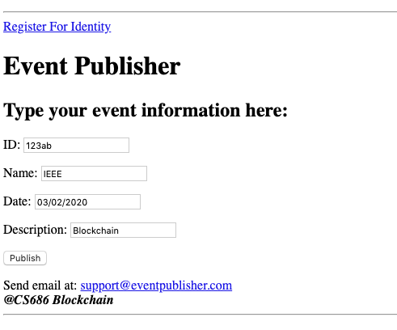

# Blockchain_Application_P5

## Blockchain Application : Event Publisher 
The idea was inspiered by [Eventbrite](https://www.eventbrite.com/)

## Description 

The project concentrates on implementing the Blockchain to publish event information (decentralized property) and using Blockchain to publish upcoming event and keep the history of the events (immutable property) of the Blockchain. Miners will publish the event info after solving hash puzzel into the blockchain to be visible to the peers. 
In case of any change in the event information, miners should publish the new block and maintain the history. 

[GO Resources](https://thenewstack.io/make-a-restful-json-api-go/)


## Functionality
-  Blocks will be produced with detail description of the event so Blockchain contains Organizer ID and the event detail as key value pair.  
-  Miners will publish event detail in the blockchain after solving the hash puzzel.
-  Miners will update their list of event transacrtion based on newly broadcasted event. 
-  Miners validate transaction before publishing.

## Define Success

-  Miners solve hash puzzel for generating the new block.
-  Miners wrap the event information into the blockchain.
-  Each block contains organizer ID, and Event information as key value pair.
-  Peers can see and download event list anytime.
-  Miners validate transaction before publishing.

### Transaction:
In this project transaction means the fee that each organizer should pay to publish their event information on the blockchain. Block publish fees are varies based of block data size. Transaction object is shown here:
```go
type Transaction struct {
	PublicKey   		*rsa.PublicKey
	EventId     		string
	EventName     		string
	Timestamp  		int64
	EventDescription    	string
	TransactionFee    	int
	Balance			int
}
```
Some of the information in the transaction struct is provided by the organizers via HTML platform shown here.


### Registration
1. After a new node is launched, it will register to get public and private key from rsa golang package library "crypto/rsa" as an Id(nodeId). 
2. Then, the node will go to any peer on its PeerList to download the current BlockChain and list of the miners. 
3. After registration, the node will start to send his request via custom HeartBeat designed for sending request before block generation. The organizer only can send request if they have enough money to publish the block.

### Public and Private Key
the organizers will get key token from rsa package library to registere and able to sign their request and broadcast it to the miners for publish it on the blockchain.

### Download
Every node should download the blockchain with the peerlist and public key list to send request to the miners. 

### Block Validation
Miners receive transaction request and stor it on their pool list to validate it based on the following criteria:
The request is valid if: 
- The organizer only can send request if they have enough balance to publish the block.
- If their signature is valid 
if the above conditions have not been met, the miners ignore the request.

### Send HeartBeat
1. Every user would hold a PeerList of up to 32 peer nodes. (32 is the number Ethereum uses.) The PeerList can temporarily hold more than 32 nodes, but before sending HeartBeats, a node will first re-balance the PeerList by choosing the 32 closest peers. "Closest peers" is defined by this: Sort all peers' Id, insert SelfId, consider the list as a cycle, and choose 16 nodes at each side of SelfId. For example, if SelfId is 10, PeerList is [7, 8, 9, 15, 16], then the closest 4 nodes are [8, 9, 15, 16]. HeartBeat is sent to every peer nodes at "/heartbeat/receive". 
2. For each Heartbeat, either heartbeat contains request or block. A node will create request if the node is organizer or generate block if the node is miner and is solving hash puzzel and has privilage to generate block. If so, add the block information into HeartBeatData and send the HeartBeatData to others.

### Receive HeartBeat:
1. When a node received a HeartBeat, the node will add the sender’s IP address, along with sender’s PeerList into its own PeerList. At this time, the number of peers stored in PeerList might exceed 32 and it is ok. As described in previously, you don’t have to rebalance every time you receive a HeartBeat. Rebalance happens only before you send HeartBeats.
2. If the HeartBeatData contains a new block, the node will first check if the previous block exists (the previous block is the block whose hash is the parentHash of the next block).
3. If the previous block doesn't exist, the node will ask every peer at "/block/{height}/{hash}" to download that block. 
4. After making sure previous block exists, insert the block from HeartBeatData to the current BlockChain. 
5. Since every node only has 32 peers, every peer will forward the new block to all peers according to its PeerList. That is to make sure every user in the network would receive the new block. For this project. Every HeartBeatData takes 2 hops, which means after a node received a HeartBeatData from the original block maker, the remaining hop times is 1.

### API
```linux
/getevent
Method: GET
Description: To access to the platform for register and create event information.

/postevent
Method: POST
Description: To register and publish the information.

/getQueryEvent
Method: GET
Description: To search to the specific event using event ID.

/getQueryEvent
Method: POST
Description: To see to the specific event using event ID.

/show
Method: GET
Description: Display the PeerList and the BlockChain. 

/canonical
Method: GET
Description: Display event information.

/upload
Method: GET
Response: The JSON string of the BlockChain.
Description: Return JSON string of the entire blockchain to the downloader.

/block/{height}/{hash}
Method: GET
Response: If you have the block, return the JSON string of the specific block; if you don't have the block, return HTTP 204: StatusNoContent; if there's an error, return HTTP 500: InternalServerError. 
Description: Return JSON string of a specific block to the downloader.

/heartbeat/receive
Method: POST
Request: HeartBeatData(see the data structure below)
Description: Receive a heartbeat.

/start
Description: You can start the program by calling this route(be careful to start only once), or start the program during bootstrap.
```

[GO Resources](https://thenewstack.io/make-a-restful-json-api-go/)

## TimeLine 

**Description** | **Status**  | 
--- | --- |
Architecture Design | DONE | 
Transaction Data Structure  | DONE| 
Generate public and private key | DONE| 
Encryption and Decryption| DONE| 
Signature and Signature Verification| DONE| 
Generate block  | DONE| 
Create HTML user interface | DONE|
Progress Report | DONE| 
Block being produced with detail description of event so blockchaincontains organizer ID and the Event detail as key value pair | DONE| 
Miner will publish event detail in the blockChain after POW| DONE| 
Peers will see the list of events| DONE| 
Miners receives transaction fee after any block generation |DONE| 
Update progress report | DONE| 
Optimize, debugging  | DONE| 
Test and Wrap up  | DONE| 
Progress Report and Demo Preparation | DONE| 

